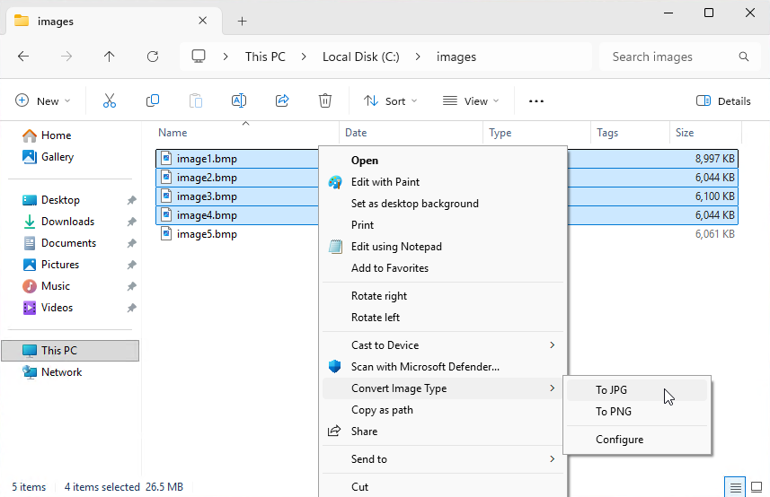
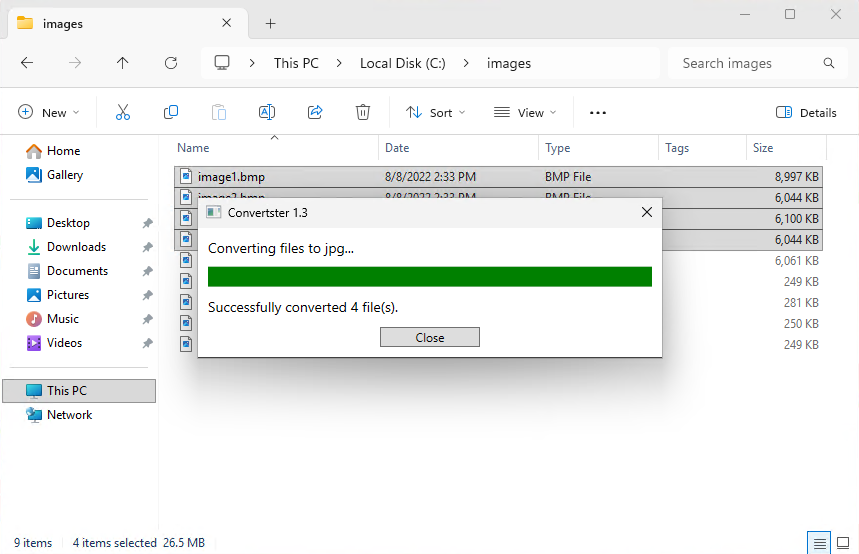

# Convertster

A simple Windows explorer context menu extension that can be used to convert images from other formats to JPG or PNG.

Supported source image file formats include: bmp, gif, png, tif, tiff, webp

This application supports Windows 10 and 11 with no additional requirements when installed with the installer.  It should work on other versions of Windows if the .net 4.8 runtime is pre-installed.

## Context menu

When the context menu is displayed when supported file types are selected, an additional convert option will be present.

## Conversion

Conversion progress is displayed while file are processed.

## Overwrite prompt

If any pre-existing files would be overwritten by the conversion process, the user is prompted.

Converster Copyright ©2026 Paul Grebenc

Licensed under the Apache License, Version 2.0 (the "License");
you may not use this file except in compliance with the License.
You may obtain a copy of the License at

    http://www.apache.org/licenses/LICENSE-2.0

Unless required by applicable law or agreed to in writing, software
distributed under the License is distributed on an "AS IS" BASIS,
WITHOUT WARRANTIES OR CONDITIONS OF ANY KIND, either express or implied.
See the License for the specific language governing permissions and
limitations under the License.
